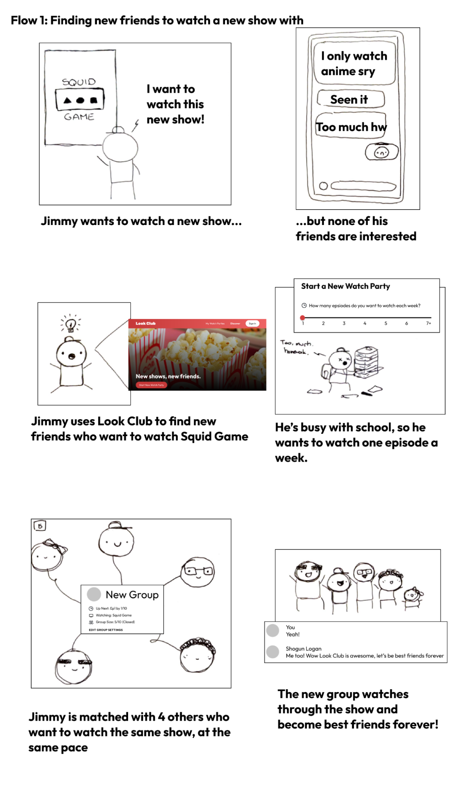
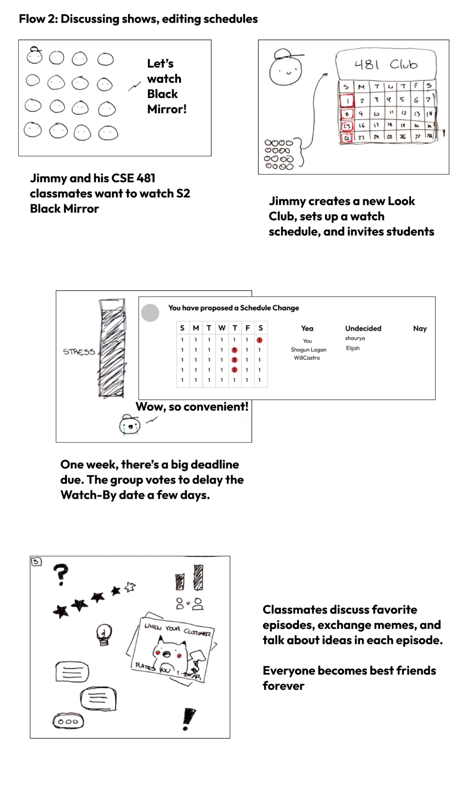
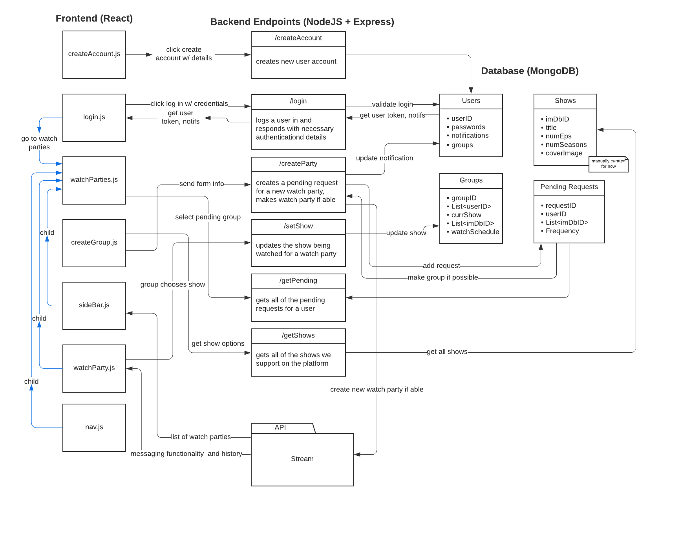

# Code Design and Specification
## Requirements

### Functional Requirements:
#### Primary
* Users can create accounts and log in.
* Users can send and receive messages within their groups
* Users can send media within their messages
* Users can set what their group is currently watching
* Users can create a new group with people that want to watch similar things
* Users can invite friends to the group that they create via invite links
* Users can edit their group’s watch schedule

#### Secondary 
* Users are blocked from posting until they acknowledge a spoiler warning and are caught up.
* Users can add other friends as users on the platform
* Users can have a profile that includes a watchlist, a bio, their friends, and a list of things they want to watch
* Users can browse and find open groups to join that are already watching something
* Users are suggested existing groups to join based on similar interests
* Users can open and close their groups to new members
* Users can change the watch schedule with a calendar
* Users can report other users who are violating platform rules.
* Users can vote within their groups in polls to make group changes, such as kicking a member, changing the watch schedule, and closing or opening the group to new members

### Technical Requirements
#### Primary
* Web application with cross-platform support
* Use a set of TV shows and provide the user with basic information about them
* Frontend should be modular to make it easily extensible
* Application should work with the Stream API to abstract away messaging functionality
* Backend will need to be able to create groups based on matching users that are looking for a new group and want to watch similar things
* Frontend should do enough work to minimize the number of backend endpoints, and the backend should do any work that needs direct access to our data

#### Secondary
* Integrate with existing APIs (like IMDB’s) to keep track of the most popular shows and their information, removing the necessity of manual curation
* Use a more complicated matching algorithm based on things that have been previously watched
* Determine the open groups that are the best fit for each user to recommend them

#### Usability Requirements
#### Primary
* Flow of screens is intuitive
* Buttons and text are readable and clickable
* The system will function regardless of browser and require no installation
* Users can search for TV shows when selecting them as something they want to watch

#### Secondary
* Users can select their watch schedule with an intuitive calendar
* Users can use the app in a discussion soon after joining the app
* The design is responsive and visually appealing
* Users can easily tell a group from the sidebar from an image identifier

## Storyboard
##### Flow One: 
TV Show Watcher wants new friends to watch a show with. 
##### Flow Two: 
Group sets consistent watch schedule, avoids spoilers on episode watch milestones, and adjusts the watch schedule under consensus when they can’t make a milestone.

## Architectural Design
The design of our system can be broken into four subcomponents: the React frontend, the NodeJS and Express backend web server, our MongoDB database, and the messaging technology. We chose React for our frontend to make our design work easier, since our website is simple with key components that get updated with new information over time. React is a great way to model the flow of this information, and it is a language that everyone in our group has experience with. We chose NodeJS for our backend due to familiarity with it, as well as simplifying our code base to be majority JavaScript. Also, its integration with MongoDB is notably simple, which is important since MongoDB’s use of NoSQL allows the database to support arrays in table entries. This along with simple interaction with Express on our backend helps streamline our technical stack.

This model relates each of these four pieces of our system. At the core of our application is the ability to communicate to others, and this messaging is abstracted away by Stream. Because it stores all of the data relating to messaging, the frontend components interact directly with Stream and do not need to pass through the backend when sending and receiving messages. However, we need the frontend to authenticate with Stream as a specific user, which requires a user token. This will be stored within our own database and provided to the frontend when a user logs in and is authenticated with our system, allowing them to begin messaging. We also need the functionality for a user to put in a request for a new group, creating what we call a “pending request”. Once enough pending requests are made to form a new group, we will create a new group with those members assigned on the backend. Additionally, we want to keep track of groups to store some additional information beyond what is stored by Stream, such as the current show being watched, so we integrated this into the model. We also want to curate the list of shows to begin with, so we plan to have a table that keeps track of those and an endpoint to fetch those when a user is browsing.
## How does this enable our storyboard and requirements?
The architecture of the web application is designed to fulfill the primary functional, technical, and usability requirements we set forth. The four subcomponents come together to create a web application that is easy to use and provides numerous functionalities to our users. 

Johnny, the main character in both our storyboards, can sign up as a user on our application. He can use any device and browser to sign up or access his account. Here, he can create a watch party request by specifying his preference of TV Show(s) and cadence of watching. The application will soon group him with users of similar preference where they can discuss, decide, and set a TV show based on consensus. Watching and discussing shows over time by the episode on a specific schedule will help him foster friendships with other users. The group can also set a new show and cadence they’re watching if they decide to. Johnny can also invite his friends to a watch group. The classmates can’t edit the schedule because of an upcoming deadline as the schedule change voting system was our secondary target, so our current architecture fulfills our priority of forming matched watch groups for discussions. Johnny and his classmates can grow their friendship by discussing their favorite shows on a fixed schedule using chat and media through the web application.
